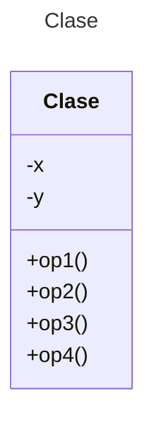

# Proyecto - Diagramas de Clases

Plantilla para ejercicios de diagramas de clases utilizando **Mermaid**

## Instrucciones
La platilla consta de dos ejercicios (Planteamiento/Diagrama de clases). Leer cada sección **Planteamiento de ejercicio** y diseñar el diagrama de clases en la sección **Diagrama de clases** inmediata siguiente.

## Planteamiento de ejercicio 1
Aplicación de Computadora  
Una aplicación necesita almacenar información sobre empresas, sus empleados y sus clientes. Tanto empleados como clientes se caracterizan por su nombre y su edad.
Los empleados tienen un sueldo bruto, los empleados que son directivos tienen una categoría, así como un conjunto de empleados subordinados.
De los clientes además, se necesita conocer su teléfono de contacto
La aplicación necesita mostrar los datos de empleados y clientes

## Diagrama de clases 1
[Editor en línea](https://mermaid.live/)

[Referencia-Mermaid](https://mermaid.js.org/syntax/classDiagram.html)

## Planteamiento de ejercicio 2
Biblioteca  
Una biblioteca tiene varios ejemplares de libros. Los libros se caracterizan por su nombre, tipo (novela, teatro, poesía, ensayo), editorial, año y autor. Los autores se caracterizan por su nombre, nacionalidad y fecha de nacimiento.
Cada ejemplar de un libro tiene un identificador y puede estar en la biblioteca, prestado, con retraso o en reparación. Los lectores pueden tener un máximo de 3 libros en préstamo.
Cada libro se presta un máximo de 30 días, por cada día de retraso, se impone una “multa” de dos días sin posibilidad de sacar un nuevo libro.
**Nota:** Añada los métodos necesarios para realizar el préstamo y devolución de libros.

## Diagrama de clases 2
[Editor en línea](https://mermaid.live/)

[Referencia-Mermaid](https://mermaid.js.org/syntax/classDiagram.html)


## Comandos Git-Cambios y envío a Autograding

### Por cada cambio importante que haga, actualice su historia usando los comandos:
```
git add .
git commit -m "Descripción del cambio"
```
### Envíe sus actualizaciones a GitHub para Autograding con el comando:
```
git push origin main
```
## Fin de Archivo
