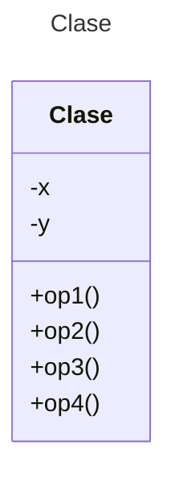

# Proyecto - Diagramas de Clases

Plantilla para ejercicios de diagramas de clases utilizando **Mermaid**

## Instrucciones
La plantilla consta de dos ejercicios (Planteamiento/Diagrama de clases). Leer cada sección **Planteamiento de ejercicio** y diseñar el diagrama de clases en la sección **Diagrama de clases** inmediata siguiente.

## Planteamiento de ejercicio 1
Compañías ferroviarias

Se desea modelar la funcionalidad requerida para un subsistema de gestión de trenes de compañías ferroviarias, tomando en consideración la siguiente información.

En primer lugar, toda compañía (con su denominación) a considerar posee al menos un tren. Cada tren está compuesto por una máquina locomotora y al menos un vagón. Pueden existir vagones y máquinas no asignados a tren alguno. Cada tren tiene un código identificador propio de su compañía, los vagones una capacidad máxima, y las máquinas locomotoras una potencia máxima.

Una compañía tiene al menos un empleado, del que se almacenan sus principales datos, como son el nombre, el número de la seguridad social y el domicilio. Según su trabajo, estos pueden ser jefes u operarios. Si es jefe, se almacena su número de teléfono. Cada empleado puede tener designados un conjunto de máquinas locomotoras y/o vagones. A su vez, cada máquina locomotora o vagón podrá estar asignado a un conjunto de empleados. Eso sí, cada tren tiene siempre asignado su jefe, y cada máquina tiene un operario que la conduce.

El diagrama de clases debe mostrar las relaciones existentes entre trenes y empleados, así como su cardinalidad.

## Diagrama de clases 1
[Editor en línea](https://mermaid.live/)

[Referencia-Mermaid](https://mermaid.js.org/syntax/classDiagram.html)

## Planteamiento de ejercicio 2
Facturas

En un programa de computadora, las facturas tienen necesariamente un conjunto de datos del proveedor, un conjunto de datos del cliente, un importe y una fecha. Los datos del cliente son el nombre y la fiabilidad de pago, mientras que los datos del proveedor son sólo su nombre. Dentro de la categoría cliente está el subtipo “cliente moroso”, que lleva también asociado el importe de la deuda. 

El diagrama de clases debe mostrar las clases Factura, Datos_del_cliente, Cliente_moroso y Datos_del_proveedor; así como las relaciones entre las clases.
## Diagrama de clases 2
[Editor en línea](https://mermaid.live/)

[Referencia-Mermaid](https://mermaid.js.org/syntax/classDiagram.html)


## Comandos Git-Cambios y envío a Autograding

### Por cada cambio importante que haga, actualice su historia usando los comandos:
```
git add .
git commit -m "Descripción del cambio"
```
### Envíe sus actualizaciones a GitHub para Autograding con el comando:
```
git push origin main
```
## Fin de Archivo
